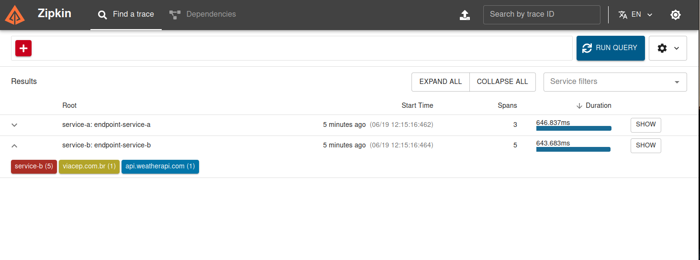
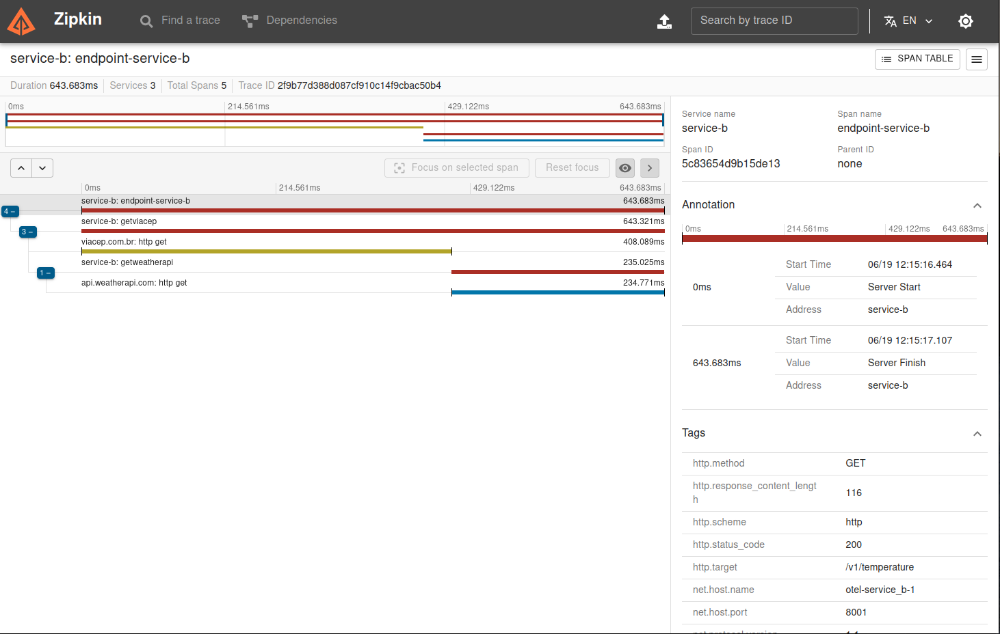

# OTEL
Desafio  fullcycle

Para configurar a API weather, no diretório service_b edite o arquivo config.toml e inclua sua chave de API.
```
[weather]
key = "your weather api key"
```
Para rodar o desafio basta executar o seguinte comando:
```
docker compose up -d
```
Execute uma requisição para obter a temperatura de um CEP e gerar a trace
```
 curl --request POST \
  --url http://localhost:8000/v1/temperature \
  --header 'Content-Type: application/json' \
  --data '{
	"cep": "02460-000"
}'

############################
 Response: 200
 {
	"StatusCode": 200,
	"message": "success",
	"data": {
		"state": "Rio+de+Janeiro",
		"temp_c": 22.4,
		"temp_f": 72.32,
		"temp_k": 295.55
	}
 }
 ```
## Zipkin
Para visualizar as traces, acesse o Zipkin-ui em http://localhost



